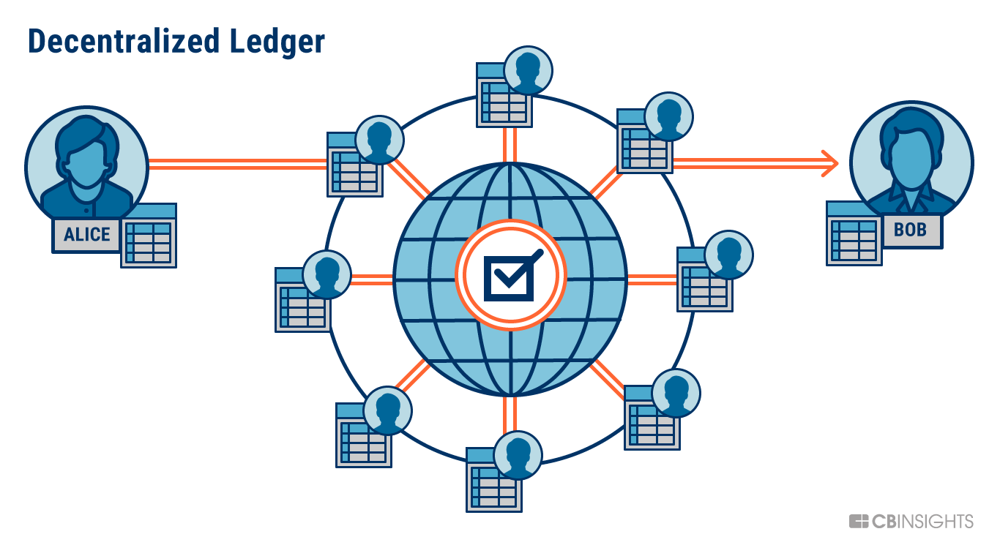
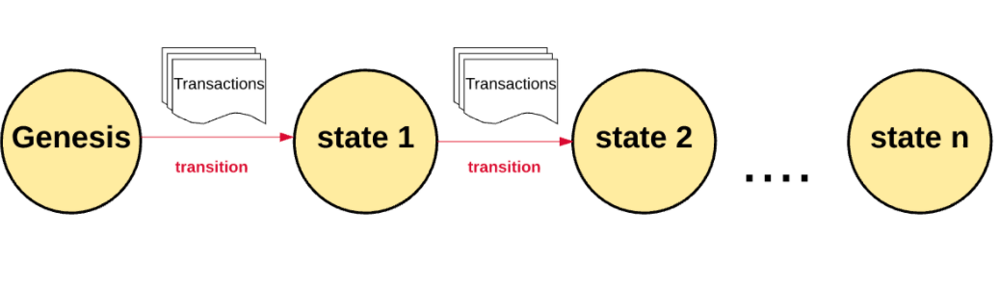
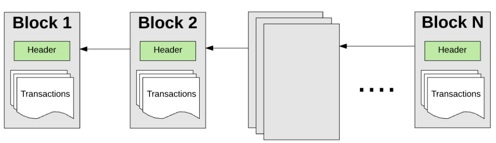

区块链是一个分布式的、数字化的、不可更改的**账本**，用于记录交易，并以安全和透明的方式存储数据。它基于一个去中心化的节点网络，这些节点共同维护一个单一的真相来源，允许参与者与系统互动，而不需要中间人。

区块是一种容器数据结构，它将交易汇总到公共账簿，即区块链中。链上的每个区块都包含一组交易，这些交易已经被节点网络通过一个被称为共识的过程验证和记录。一旦一个区块被添加到链上，它就不能被改变或删除，从而为网络上的所有交易创建一个不可改变的记录。

区块链是由匿名人士（或团体）中本聪推广的，他们在2009年发布了[比特币网络](https://bitcoin.org/)。比特币是一个加密货币网络，它主要处理BTC资产在网络上的转移，没有可信的中间人或权威机构，同时确保网络本身是安全的，不能被入侵。 P.S. 比特币网络也可能是世界上最大的错误赏金--如果你能入侵它，你就会立即成为万亿富翁）。

随着时间的推移，比特币的这种设计激发了其他更有能力的区块链网络的出现，比如[以太坊](https://ethereum.org/)。在接下来的会议中，我们将学到很多关于以太坊的知识。

## 状态管理

区块链在启动时有一个创世状态,第一个区块一般被称为创世区块。比特币的创世状态发生在2009年公共网络启动时。以太坊的创世状态发生在2015年，当时它启动了。

由于有数以百万计的交易，交易被分组到区块中。因此而得名。这些区块以一种可加密验证的方式串联在一起，因此它们在历史上是可追溯的。网络的当前状态可以在任何时候重新计算，从创世区块开始，根据每个区块到目前为止的信息进行状态转换。

## 节点

区块链网络是通过计算机节点的[点对点](https://en.wikipedia.org/wiki/Peer-to-peer)分布式网络自主管理的。在不涉及太多细节的情况下，你可以简单地认为网络中的每个节点都保存着全球交易账本的副本。因此，每个节点可以单独验证和审计网络上发生的交易，并确保没有非法行为。

另一种类型的节点，称为采矿节点，负责将网络上的新交易组合成一个区块，对其进行验证，并建议其他人将该区块纳入全球分类账。挖矿在计算上是很困难的，而且安全地进行非常重要，所以那些区块被接受的矿工会因为他们的努力工作而获得象征性的奖励。

区块链的使用证实了每个单位的价值只被转移了一次，中本聪提出的巧妙机制解决了长期存在的分散式双重消费问题。

## 去中心化

通过在节点的点对点网络中存储数据，区块链是一个去中心化的网络。这比传统的以集中方式存储数据的方法有很大好处。有显著的例子说明了中心化的问题--我们将在此列出其中的几个。

- 中心化系统的数据泄露暴露了大量的数据
- 中心化的当局可以审查和关闭言论
- 对中央机构的依赖意味着上游的问题会影响到下游的消费者（例如，AWS瘫痪意味着大部分的互联网都会随之瘫痪）。

另一方面，去中心化带来了响应的好处。

- 没有审查制度，因为没有任何一个机构或中间人可以审查你。
- 没有停机时间，因为整个网络是在全球1000个节点上运行的。
- 抗攻击能力强，不可能篡改或破坏数据

## 资源

### 必须观看

- [But how does bitcoin actually work? by 3Blue1Brown](https://www.youtube.com/watch?v=bBC-nXj3Ng4)
- [Blockchain Demo by Anders Brownworth](https://andersbrownworth.com/blockchain/)

### 推荐

- [Secure Hash Algorithm](https://en.wikipedia.org/wiki/Secure_Hash_Algorithms)
- [Byzantine General problem](https://river.com/learn/what-is-the-byzantine-generals-problem/)
- [A Gentle Introduction to Blockchain Technology by Bits On Blocks](https://bitsonblocks.net/2015/09/09/gentle-introduction-blockchain-technology/)
- [How does a blockchain work by Simply Explained](https://www.youtube.com/watch?v=SSo_EIwHSd4)

