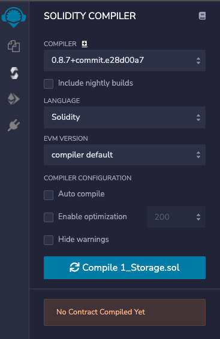
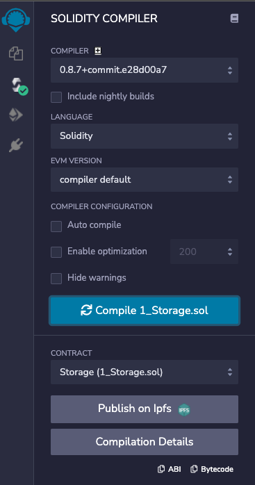
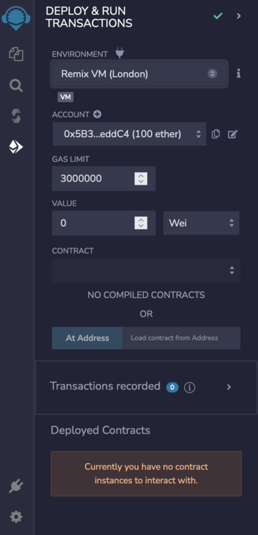
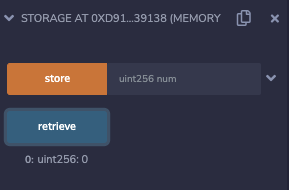
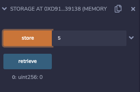
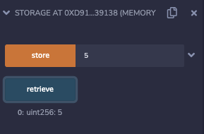

Remix是一个开源的、用于以太坊开发的网络和桌面集成开发环境（IDE）。它是在以太坊上开始构建的最简单的开发工具，并有大量的插件来扩展其经验。

Remix可以帮助你直接在浏览器中编写Solidity代码，并拥有测试、调试和将智能合约部署到区块链上的工具。

您可以访问Remix网站：https://remix.ethereum.org/

## Remix导航

当你第一次打开Remix时，你会看到这样一个屏幕。

在左边的侧边栏，您可以在文件资源管理器、Solidity 编译器、部署器和扩展面板之间切换。

在底部，有一个输出面板，它显示来自您的编译、您的部署和您的函数调用的输出。

中间是你将编辑代码的地方。目前它显示的是IDE的主屏幕，但一旦我们打开一个文件，它将成为代码编辑器。

## Remix工作流程

在侧边栏，如果你看一下合同文件夹下--Remix带有3个基本智能合同，以帮助人们学习Solidity。让我们看一下1_Storage.sol。

我们现在可以看到代码编辑器。

在文件资源管理器中，我们还可以看到创建新文件或目录、上传本地文件或从Github导入文件的选项。

为了编译我们的合同，我们转移到Solidity编译器标签，我们将在侧边栏看到类似这样的东西。

在这里，我们可以选择我们想要的编译器版本，我们正在使用的智能合约编程语言（大多数情况下，你将只使用Solidity），以及一些进一步的配置选项。

注意：Remix中列出的另一种编程语言，Yul，是一种较低级别的语言。它是用来进行中级编译的，比Solidity更接近硬件。99%的情况下，您不会用Yul进行编码。在此阅读更多关于Yul的信息 - https://docs.soliditylang.org/en/v0.8.9/yul.html

点击Compile 1_Storage.sol将编译合同并使其准备好部署。

转到部署选项卡，我们将在侧边栏看到类似这样的东西。

这里首先要注意的是环境。Remix提供了一个Remix VM（London）--这是一个以太坊虚拟机（EVM）的模拟器，在浏览器中运行London Upgrade。这允许快速测试和调试你的智能合约，只要你的合约不依赖于部署在真实以太坊网络上的另一个合约。值得庆幸的是，我们的存储合约并不依赖于此，所以我们可以在Remix虚拟机中对其进行测试。

如果要部署到实际的网络，我们要把我们的环境改为那里列出的其他选项之一（稍后会有更多内容）。

除了Remix VM（London），Remix还创建了一组假账户，都装了100个ETH，用于测试。

从下拉菜单中选择1_Storage.sol合约，然后点击Deploy来部署合约。

一旦合约被部署，你会在已部署的合约部分看到它--现在你可以在你的智能合约上调用功能。

调用retrieve函数现在将返回一个0的值，这是Solidity中整数的默认值。

另外，我们将在输出面板上看到一些关于调用Storage.retrieve的日志，这是我们的函数。

现在，让我们试着调用数字为5的存储值。

同样，我们在输出面板上看到一些关于调用Storage.store的日志。现在，如果我们再次尝试检索，输出将是5。

> 注意 - 我们做的这些函数调用/交易都没有打开你的数字钱包（Metamask）。这是因为我们目前在Remix VM（伦敦）进行测试，而这只是一个使用假账户的模拟器。当部署到真正的网络（Testnet或mainnet）时，交易需要通过你的数字钱包确认和签署。

## 推荐
仔细阅读[Remix IDE Docs]([Remix IDE Docs](https://remix-ide.readthedocs.io/en/latest/))中的文档
玩一玩Remix提供的默认智能合约，了解一下工作流程