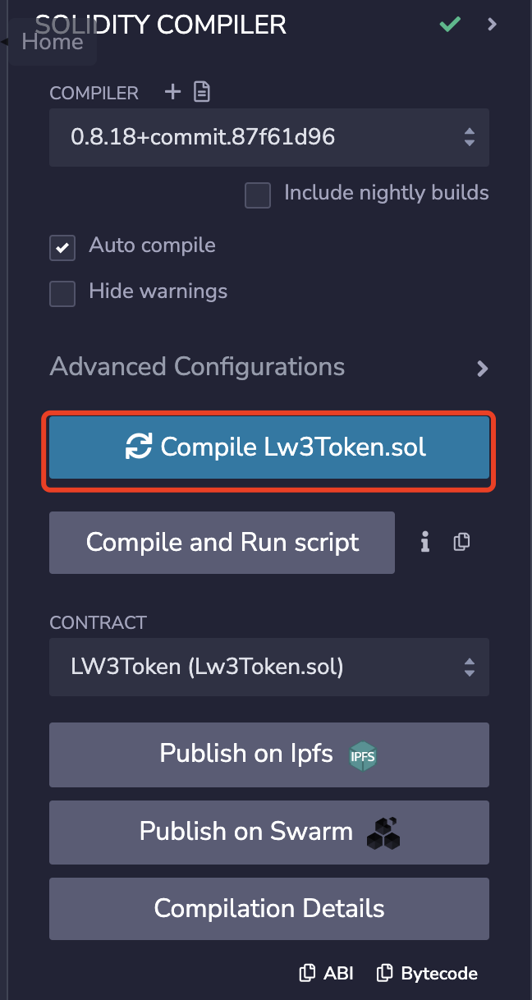
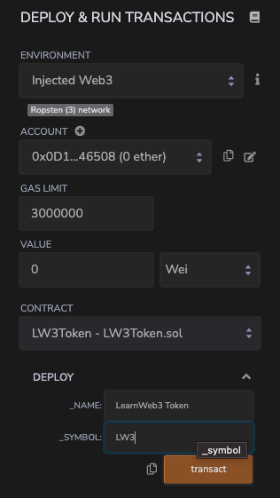
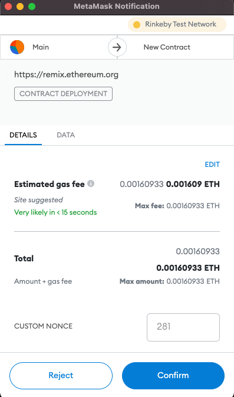
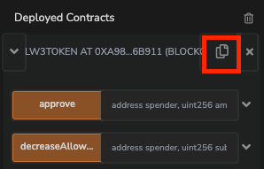
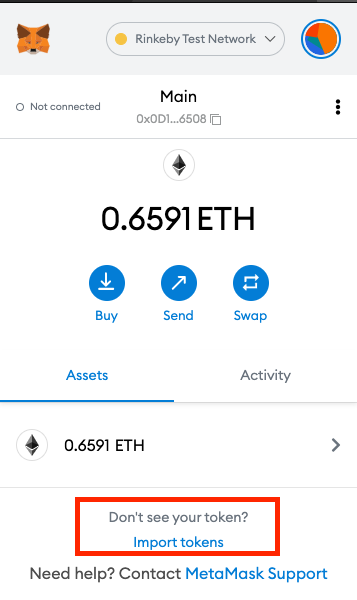
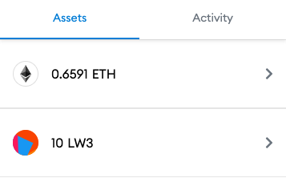

在本篇文章中，你将学习如何在以太坊上创建和部署ERC-20代币。

本教程中使用[Metamask](https://metamask.io/)和[Remix IDE](https://remix.ethereum.org/) 。

## 什么是ERC-20

`ERC` 代表着 `Ethereum Request for Comment`. 从本质上讲，它们是已经被社区批准的标准，用于传达某些用例的技术要求和规范。

具体来说`ERC-20`就是一个标准，它概述了可替换代币的技术规范。

> 可替换的代币是指代币的所有 "部分 "都是一样的。将1个ETH换成另一个1个ETH并不会改变什么。你仍然拥有1个ETH。因此，ETH是一种可替代的代币。所有的法定货币也是可替换的。

以太坊上的大多数代币都符合ERC-20规范。遵循像ERC-20这样的标准，使用ERC-20代币的应用程序开发人员能够轻松地支持所有ERC-20代币，而不必单独为它们编写专门的代码。

例如，像Uniswap这样的去中心化交易所允许你将任何代币换成任何其他代币。这之所以可能，是因为几乎所有的代币都遵循ERC-20标准，所以Uniswap可以编写代码，与所有遵循该标准的代币一起工作。

## 准备

- 确保你已经下载并安装了[Metamask](https://metamask.io/)。

- 选择`Goerli Testnet`网络来工作

- 通过以下任何一个龙头，在Goerli上申请一些测试网的以太网。

  - [Alchemy Faucet](https://goerlifaucet.com/)

  - [Paradigm Faucet](https://faucet.paradigm.xyz/)

一旦你把这些都设置好了，就可以开始了!

## 编写代码

我们使用[Remix IDE](https://remix.ethereum.org/)去编写智能合约。

在Remix中创建一个名为`LW3Token.sol`的合约文件，在合约中编写如下代码

```solidity
// SPDX-License-Identifier: MIT
pragma solidity ^0.8.0;

import "https://github.com/OpenZeppelin/openzeppelin-contracts/blob/master/contracts/token/ERC20/ERC20.sol";

contract LW3Token is ERC20 {
    constructor(string memory _name, string memory _symbol) ERC20(_name, _symbol) {
        _mint(msg.sender, 10 * 10 ** 18);
    }
}
```

让我们一行行的理解一下代码

```solidity
pragma solidity ^0.8.0;
```

这一行指定要使用的 Solidity 的编译器版本。`^0.8.0` 表示任何大于` 0.8.0` 的版本。通常，您希望使用最新的 Solidity 编译器版本，因为新版本通常意味着新的功能或优化。

```solidity
import "https://github.com/OpenZeppelin/openzeppelin-contracts/blob/master/contracts/token/ERC20/ERC20.sol";
```

该行从[OpenZeppelin](https://openzeppelin.com/) (OZ)导入`ERC-20`代币标准。OZ是一家Ethereum安全公司。在其他方面，OZ为流行的智能合约标准开发了参考合约，这些合约经过了全面的测试和安全。每当实施一个需要符合标准的智能合约时，尽量找一个OZ的参考实现，而不是从头开始重写整个标准。

可以通过以下链接查看ERC-20标准合约的实施情况 - https://github.com/OpenZeppelin/openzeppelin-contracts/blob/master/contracts/token/ERC20/ERC20.sol

```solidity
contract LW3Token is ERC20 {
    ...
}
```

这在我们的Solidity文件中指定了一个新合约，名为LW3Token。另外，它说这个合约是ERC20的一个实例。ERC20在这里指的是我们从OpenZeppelin导入的标准合约。

本质上，我们正在扩展我们从OpenZeppelin导入的ERC20标准合约。因此，所有内置于ERC20的功能和逻辑都可供我们使用，我们可以在上面添加我们自己的自定义逻辑。

如果你熟悉面向对象的编程原则，你可以把它看成是一个类对另一个类的扩展。

```solidity
constructor(string memory _name, string memory _symbol) ERC20(_name, _symbol) {
     ...
}
```

这个位子的语法稍微有点奇怪，你可能以前没有见过。

基本上，我们创建了构造函数，在智能合约首次部署时被调用。在构造函数中，我们希望用户提供两个参数--_name和_symbol，这两个参数指定了我们的加密货币的名称和符号。例如，名称=Ethereum，符号=ETH。

之后发生的事情更有意思。在指定构造函数后，我们立即调用ERC20(_name, _symbol)。

我们从OpenZeppelin导入的ERC20合约有自己的构造函数，它需要名称和符号参数。由于我们正在扩展ERC20合约，我们需要在部署我们的合约时初始化ERC20合约。因此，作为我们构造函数的一部分，我们也需要调用ERC20合约的构造函数。

因此，我们要为我们的合约提供_name和_symbol变量，我们立即将其传递给ERC20构造器，从而初始化ERC20智能合约。

熟悉`JavaScript`的小伙伴可以用如下的代码类比理解一下

```js
class LW3Token extends ERC20 {
  constructor(_name, _symbol) {
    super(_name, _symbol)
  }
}
```

```solidity
_mint(msg.sender, 10 * 10 ** 18);
```

_mint是ERC20标准合约中的一个内部函数，这意味着它只能由合约本身调用。外部用户不能调用这个函数。

由于你作为开发者想在部署这个合约时收到一些令牌，我们调用`_mint`函数来给`msg.sender`铸造一些令牌。

`_mint`需要两个参数 - 一个要铸造的地址，以及要铸造的代币数量。

`msg.sender`是由Ethereum虚拟机注入的全局变量，它是进行这项交易的地址。由于你将是部署此合约的人，你的地址将出现在`msg.sender`中。

10 * 10 ** 18指定你要10个完整的代币被铸造到你的地址。

> 注意：你可能想知道为什么我们不直接在金额中写10，而要写10 ** 18（实际上是10 ^ 18）。

本质上，Solidity不支持浮点数--也就是小数。另外，由于ERC20代币与货币打交道，使用浮点数字是一个坏主意。

作为一个例子，考虑用支持浮点数的语言进行简单的计算（1/3）*3。你认为这能返回什么？

如果你认为它会返回1，那你就错了。

由于浮点计算的不准确性，因为计算机不能表示无限的数字，(1/3)*3实际上得到的是0.999999999这样的数字。

因此，在表示金融货币时，由于计算错误，不使用小数。作为一种替代方法，我们将每种货币表示为相对于该货币的最小不可分割部分的金额。例如，1美元被表示为100美分，因为在处理美元时，你不可能比1美分更小。在这个数字系统中，1美分只是1，而不是0.01。0.33美元被表示为33，而不是（1/3）。

ERC20代币默认以18位小数工作。因此，在这种情况下，1个完整的LW3代币实际上被表示为10 ^ 18。因此，为了得到10个完整的LW3代币，我们使用10 * 10 ** 18。

## 编译

编译你的合同时，可以按 "保存"（Windows下为CTRL + S，Mac下为Command + S），或者到Remix的编译器标签，选择LW3Token.sol，然后点击编译。



## 部署

前往Remix中的`Deployer`标签。

选择`Injected Provider - MetaMask`环境（确保你在Goerli测试网络上），并连接你的Metamask钱包。

选择`LW3Token.sol`合约，并为构造参数`_name`和`_symbol`输入数值。



点击`Transact`并批准来自Metamask的交易，以部署你的合同!



部署后，合同应显示在`Deployed Contracts`部分。点击`Copy Address`按钮，复制合同地址。



去[Goerli Etherscan](https://goerli.etherscan.io/)搜索你的合同地址，你应该在那里看到它!

## 在Metamask中查看令牌

你可能会注意到，即使你向你的地址铸造了代币，但它们并没有在Metamask中显示出来。

这是因为Metamask无法检测到随机的ERC20代币余额（因为简直有数十万个）。他们有一个最知名的ERC20代币的列表，可以自动显示，但除此之外，对于你自己的代币，你通常需要告诉Metamask手动将其添加到你的钱包。

这样做

- 复制你的合同地址

- 打开Metamask，点击`Assets`中的`Import Tokens`

  

- 输入你的代币合约地址，它应该自动检测到名称和小数的数量

- 点击添加，你将在Metamask中看到你的余额!

  

恭喜你！你已经成功地部署和铸造了你自己的ERC20代币。你已经成功部署并铸造了你自己的ERC20代币!