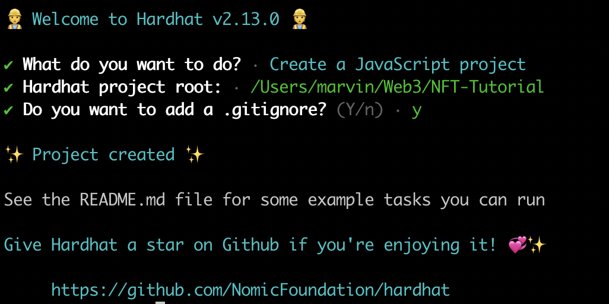

## 准备

- 设置[Metamask](./05-%E8%AE%BE%E7%BD%AE%E5%8A%A0%E5%AF%86%E9%92%B1%E5%8C%85.md)
- 检查你的电脑是否有Node.js。如果没有，请从[这里](https://nodejs.org/en/download/)下载

## 构建

### 智能合约

为了构建智能合约，我们将使用[Hardhat](https://hardhat.org/)。Hardhat是一个Ethereum开发环境和框架，为全栈开发而设计。简单地说，你可以编写你的智能合约，部署它们，运行测试，并调试你的代码。

要设置一个Hardhat项目，请打开终端并执行这些命令

```bash
mkdir NFT-Tutorial
cd  NFT-Tutorial
npm init --yes
npm install --save-dev hardhat @nomicfoundation/hardhat-toolbox
```

在你安装Hardhat的同一目录下运行。

```bash
npx hardhat
```

选择`Create a Javascript Project`并按步骤操作。最后，你将有一个新的Hardhat项目可以使用



### 编写NFT合约代码

让我们安装一些OpenZeppelin合约，这样我们就可以访问ERC-721合约了。在你的终端，执行以下命令。

```bash
npm install @openzeppelin/contracts
```

在合同文件夹中，创建一个名为NFTee.sol的新Solidity文件

现在我们将在NFTee.sol文件中写一些代码。我们将导入Openzeppelin的ERC721合约。ERC721是创建NFT的最常见的标准。

```solidity
// SPDX-License-Identifier: MIT
pragma solidity ^0.8.0;

// 导入 openzepplin 合约
import "@openzeppelin/contracts/token/ERC721/ERC721.sol";

contract NFTee is ERC721 {
		constructor() ERC721("NFTee", "ITM") {
        // 给自己分配一个NFT
        _mint(msg.sender, 1);
    }
}
```

编译合同，打开终端并执行这些命令

```bash
npx hardhat compile
```

### 配置部署

让我们把合同部署到`goerli`测试网络。要做到这一点，我们要写一个部署脚本，然后配置网络。首先，在`scripts`文件夹下创建一个新文件/替换默认文件，名为`deploy.js`，并在那里写下以下代码。

```js
// 从`hardhat`包中导入ethers
const { ethers } = require("hardhat");

async function main() {
  /*
		在ethers.js中合约工厂是一个抽象，用来部署一个新的智能合约
		这里的nftContract是一个工厂用来创建我们的`NFTee contract`实例
	*/
  const nftContract = await ethers.getContractFactory("NFTee");

  // 部署合约
  const deployedNFTContract = await nftContract.deploy();

  // 等待合约部署
  await deployedNFTContract.deployed();

  // 打印部署合约的地址
  console.log("NFT Contract Address:", deployedNFTContract.address);
}

// 调用main函数，如果有异常则会打印异常信息
main()
  .then(() => process.exit(0))
  .catch((error) => {
    console.error(error);
    process.exit(1);
  });
```

现在在NFT-Tutorial文件夹中创建一个.env文件并添加以下几行。按照下面的指示。

前往[Quicknode](https://www.quicknode.com/?utm_source=learnweb3&utm_campaign=generic&utm_content=sign-up&utm_medium=learnweb3)并注册一个账户。Quicknode是一个节点提供商，让你连接到各种不同的区块链。我们将使用它来通过Hardhat部署我们的合约。创建一个账户后，在Quicknode上创建一个端点，选择Ethereum，然后选择Goerli网络。点击右下角的继续，然后点击创建端点。复制HTTP提供者中给你的链接，并将其添加到下面`QUICKNODE_HTTP_URL`的`.env`文件中。

要获得你的私钥，你需要从Metamask导出它。打开Metamask，点击三个点，点击`Account Details`，然后`Export Private Key`。请确保你使用的是一个没有主网资金的测试账户。在你的`.env`文件的`PRIVATE_KEY`变量中添加下面这个私钥。

```
QUICKNODE_HTTP_URL="add-quicknode-http-provider-url-here"

PRIVATE_KEY="add-the-private-key-here"
```

你可以把Quicknode想象成区块链的AWS EC2。它是一个节点供应商。他们运行Ethereum节点（在其他区块链中），并让我们访问它们。它通过为我们提供节点来帮助我们与区块链连接，这样我们就可以读取和写入区块链。你的Hardhat应用程序将采取你的智能合约，并将其发送到Quicknode给我们的以太坊节点，以便它可以部署在Goerli网络上。

- 现在我们将安装`dotenv`包，以便能够导入env文件并在我们的配置中使用它。在你的终端，执行这些命令。

  ```bash
  npm install dotenv
  ```

- 现在打开`hardhat.config.js`文件，我们将在这里添加`goerli`网络，这样我们就可以将我们的合同部署到Goerli网络。将hardhat.config.js文件中的所有行替换为下面给出的行

  ```js
  require("@nomicfoundation/hardhat-toolbox");
  require("dotenv").config({ path: ".env" });
  
  const QUICKNODE_HTTP_URL = process.env.QUICKNODE_HTTP_URL;
  const PRIVATE_KEY = process.env.PRIVATE_KEY;
  
  module.exports = {
    solidity: "0.8.9",
    networks: {
      goerli: {
        url: QUICKNODE_HTTP_URL,
        accounts: [PRIVATE_KEY],
      },
    },
  };
  ```

- 要在你的终端部署，请输入。

  ```bash
  npx hardhat run scripts/deploy.js --network goerli
  ```

- 将打印在终端上的NFT合同地址保存在你的记事本中，你会需要它。


## 在Etherscan上验证

- 进入[Goerli Etherscan](https://goerli.etherscan.io/) ，搜索打印出来的地址。
- 如果该地址在etherscan上被打开，你就已经部署了你的第一个NFT 🎉
- 点击交易的哈希值，查看交易细节，检查是否有代币转移到你的地址。


## 参考代码
https://github.com/uuuhds/NFT-Tutorial

