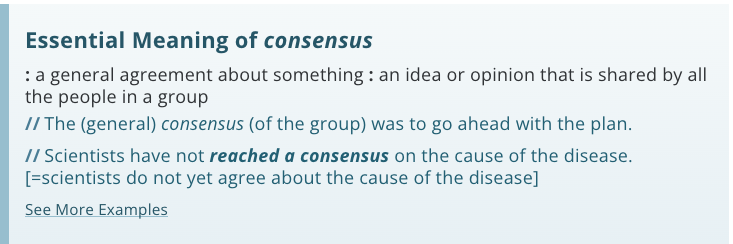
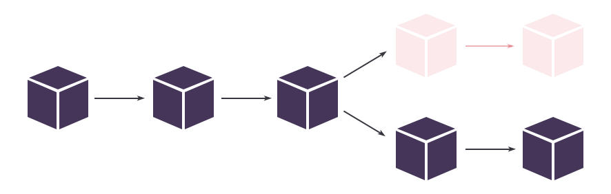

以太坊和比特币一样，曾经使用一种叫做工作证明（PoW）的共识协议。这允许以太坊网络上的所有节点就区块链的当前状态达成一致，并确保网络免受各种攻击。

> 最近在2022年9月15日，Ethereum合并完成，Ethereum转向了股权证明系统(PoS)。

## 什么是共识

梅里亚姆-韦伯斯特对 "共识 "一词的定义如下。

## 什么是共识协议？

谈到像以太坊这样的区块链，本质上是分布式的去中心化数据库，网络节点需要就网络的当前状态达成协议。

共识协议帮助我们就网络在某一点上的状态达成协议，也就是共识。

虽然共识协议与构建dApps没有直接关系，但了解它们将帮助你理解很多其他的概念，并建立你的基础知识。

共识协议主要是经济系统，有助于防止某些类型的攻击。理论上，攻击者可以通过控制51%的网络来破坏共识。共识协议旨在使这种 "51%的攻击 "在经济上是不可行的。不同的机制以不同的方式来解决这个问题。

## 什么是工作证明？

工作证明是一种比特币和以太坊都在使用的共识协议。

### 区块生产

在工作证明下，矿工负责生产新区块。网络中的矿工相互竞争，创造充满已处理交易的新区块。赢家会与网络中的其他人分享区块，并为他们的辛勤工作赚取新造的ETH。

比赛由谁的计算机能最快地解决一个难以计算的数学难题而获胜。这个问题在计算上很难解决，但非常容易验证。这个问题的解决方案就是我们在《什么是挖矿》教程中讨论的 "合法证书"。

### 网络安全

要想获得对网络51%的控制权，就需要网络51%的计算能力，这就保证了网络的安全性。然而，由于工作证明（Proof of Work）用挖矿奖励来激励矿工，很多不同的矿工群体都对运行挖矿节点感兴趣。因此，获得网络上所有计算能力的51%，需要在设备和电能方面进行巨大的投资--这意味着你最终的花费很可能超过你的收入。

## Sybil Resistance

从技术上讲，工作证明本身并不是一个共识协议--尽管为了简单起见，它经常被称为共识协议。它们实际上是抗塞比尔机制和区块生产者选择器--一种决定谁将成为最新区块的生产者的方法。

女巫攻击是指一个用户或团体假装成许多不同的用户的问题。对于一个去中心化的区块链来说，抵御这种类型的攻击是至关重要的，因为它允许矿工根据他们投入的资源获得奖励，而不仅仅是随机选择。

假设，如果我们只是通过随机选择而不是工作证明来选择一个区块的生产者，人们可以很容易地执行一个女巫攻击。

假设网络上有两个矿工。爱丽丝和鲍勃。通过随机选择，他们应该各自获得大约一半的采矿奖励。现在，查理出现了，但他假装是两个不同的用户--查理和达西。通过随机选择，查理最终会得到1/2的采矿奖励，因为他假装是两个不同的用户，而爱丽丝和鲍勃只得到1/4，而不是他们应该得到的1/3。

工作证明（Proof of Work）通过让矿工拿出大量的计算能力作为抵押，从而让他们耗费大量的电能，来防止女巫攻击。这是通过解决计算难题来证明矿工正在 "投入工作"。这对女巫攻击起到了经济威慑作用。

由于奖励是发放给成功的矿工的，而矿工的成功与他们在网络上的计算能力份额大致成正比，因此，如果你假装是1个用户或2个或100个用户，这已经不重要。你会得到相同数量的挖矿奖励，因为你的计算能力保持不变。

## 链选择规则

偶尔，两个矿工会大致在同一时间产生有效的区块。这可能导致网络中的不同节点在其区块链中包括不同的区块。这方面的技术术语是分叉。

然而，为了使区块链以稳定的方式进行，需要选择一条连续的链作为 "正确的链"，以防止状态的分裂。

比特币和以太坊使用 "最长的链 "规则来做到这一点。哪条链被更多的节点接受并持续增长，就被选为 "正确的链"，而分叉的链就被淘汰。

工作证明和最长链规则的组合被称为 "中本共识"--以比特币的发明者中本聪命名。

偶尔，这意味着作为临时分叉的一部分被开采的交易可能会在分叉被摆脱后回滚，以支持另一个更长的链。这就引入了 "最终性 "的概念。

> 形成分叉链并最终被删除的区块被称为叔叔区块。矿工显然为生产该叔叔区块付出了努力，很可能只是因为网络延迟而失去了挖矿奖励。因此，以太坊网络仍然对Uncle区块矿工的辛勤工作给予1.75ETH的奖励。

## 终结

当一个交易是一个不能改变的区块的一部分时，它在以太坊上具有 "最终性"。

由于矿工以分散的方式工作，两个有效的区块可以同时被开采。这就形成了一个临时分叉。最终，在后续区块被挖出并加入后，这些链中的一个将成为被接受的链，使其更长。

但让事情更复杂的是，在临时分叉上被拒绝的交易可能已经包括在被接受的链上。这意味着它可能被逆转。因此，最终性指的是你在考虑交易不可逆转之前应该等待的时间。对于以太坊，建议的时间是6个区块或刚刚超过1分钟。六个区块后，你可以相对自信地说，该交易是成功的（超过99.999%的机会，现在不会被逆转）。你可以等得更久，以获得更大的保证。

## POW的Work是什么

我们一直在谈论一个计算上很难的数学问题，矿工需要解决这个问题来提供合法的证书。但这实际上意味着什么呢？

从本质上讲，我们要证明矿工花费了能量和计算能力来计算该区块。而且，他们这样做比其他人快。如果我们能证明这一点，这意味着矿工基本上花了钱和时间（以能源和计算的形式），所以他们可以得到一个提出新区块的机会。

生产有效的区块符合矿工的最大利益，因为如果他们被发现说谎（这很容易，因为验证证书很容易）--他们只是白白浪费了所有的能量和计算，因此失去了他们的金钱和时间。因此，解决数学问题意味着矿工真的很想提出新区块，并愿意花费精力和计算来获得奖励。

以太坊的工作证明协议，Ethash，需要矿工经历激烈的试错竞赛。这个过程如下。

- 矿工选择一组交易，以包括在一个潜在的区块中
- 基于他们创建的区块，网络有规则地从区块链网络的当前状态中选择一个数据片（大约~1GB大小）。这些规则不是特别相关，但你可以在Ethash文档中阅读更多的内容。
- 他们把数据集通过散列函数来计算一个目标值。这个目标是一个数字，它与挖矿难度成反比。采矿难度越高，目标值越低，反之亦然。
- 然后，矿工用蛮力试图找到另一个随机数，称为nonce。
- 将数据集、目标、nonce和其他几个值的组合通过散列函数，应该会得到一个低于目标的数字。
- HashFunction(dataset, target, nonce, ...) = a number
- 挖矿难度越高，目标越低，因此越难找到满足这一条件的nonce。
- 矿工们不断试错，以找到满足条件的nonce的有效值。没有计算nonce的公式。

> 挖矿难度根据网络上有多少矿工而变小或变大，以确保大约每15秒就能可靠地生产一个区块。如果它变得太容易，有很多矿工，区块的生产速度将远远超过15秒。同样，如果它变得太难，没有很多矿工，区块将需要很长的时间来生产。难度是由网络自动计算的。

除了蛮力之外，没有其他方法可以解决这个问题，因为目前还没有一种方法可以逆转哈希函数。因此，要知道某个nonce在附加到数据集时是否会产生一个特定的哈希值，唯一可能的方法是尝试nonce的随机值并进行检查。

花点时间彻底阅读本节，这就是工作证明的全部内容。它可能看起来很反常，但想想我们一开始想证明的是什么。我们想证明，矿工为生产这个区块做了艰苦的工作，这对他们来说不是小菜一碟。既然他们做了艰苦的工作，那么不撒谎对他们来说是最有利的。这种计算谜题正是如此，因为找到一个有效的nonce是一个计算上的难题--但验证它很容易，所以其他节点可以很容易地验证矿工确实找到一个有效的nonce，这意味着他们确实付出了努力。

## 比特币究竟是如何运作的？

https://www.youtube.com/watch?v=bBC-nXj3Ng4

## 资源

- [Anderson Brownworth Blockchain Mining Demo](https://andersbrownworth.com/blockchain)
- [What is Proof of Work? by Binance Academy](https://www.youtube.com/watch?v=3EUAcxhuoU4)
- [A technical explanation of Proof of Work by Khan Academy](https://www.youtube.com/watch?v=9V1bipPkCTU)
- [51% Attacks](https://en.bitcoin.it/wiki/Majority_attack)
- [Transaction Finality](https://blog.ethereum.org/2016/05/09/on-settlement-finality/)
- [Ethash](https://ethereum.org/en/developers/docs/consensus-mechanisms/pow/mining-algorithms/ethash/)